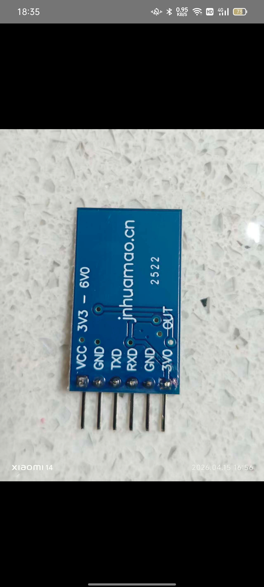
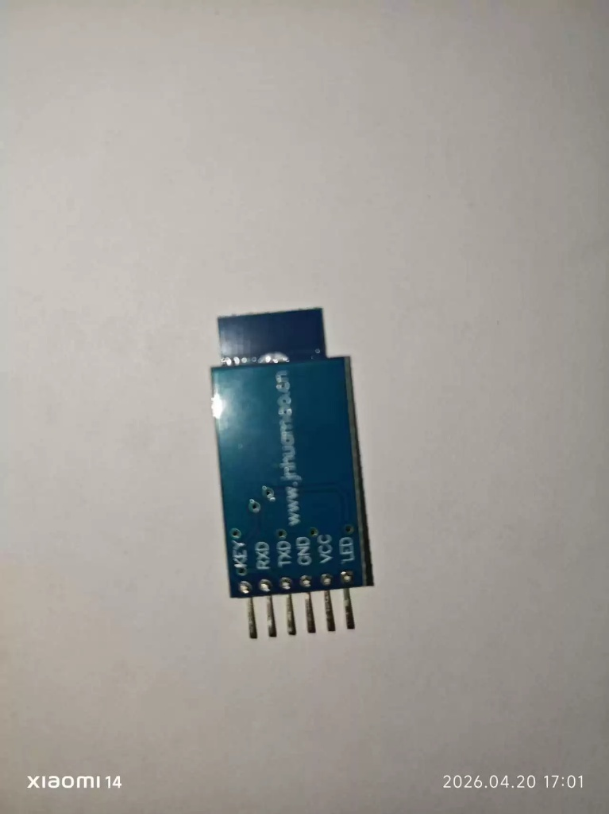

# KiCad HM-10 Breakout Boards Library 📶

The HM-10 Bluetooth BLE module market is quite messy. If you buy a breakout board (usually with 6 pins), there are **various common variants** with completely reversed control pins or different layouts. 

Using the wrong symbol can cause your logic to fail, or worse, damage your MCU's IO ports! I created this KiCad symbol library to include verified variants so you don't burn your board.

## 💡 Origin & Motivation
This library was born out of necessity while following the excellent KiCad tutorial video: **[Lab #1.a) - How to create a schematic diagram in KiCad](https://www.youtube.com/watch?v=EVtMQmhW2Ng)**. 

During the tutorial, it became apparent that while standard libraries exist for bare chips, there were **no suitable schematic symbols and matching footprints for the actual 6-pin HM-10 breakout modules** used in real-world projects. I decided to draw my own robust library to solve this exact problem.

*For additional context on how to wire and interface with these modules, see this referenced guide:*
📘 **[HM-10 Bluetooth 4.0 BLE Module Tutorial (PDF)](https://engineering.fresnostate.edu/research/bulldogmote/documents/11.%20HM10%20BLE_FTDI.pdf)**

---

## 📦 Symbols Included in this Library

### 1. `HM-10Module_ZS040` (Standard Variant)
This matches the classic generic blue board (often with "ZS-040" printed on the back). 
* **Pinout (1 to 6):** `STATE`, `RXD`, `TXD`, `GND`, `VCC`, `EN`
* **Datasheet:** [Mouser ZS-040 Specsheet](https://www.mouser.com/catalog/specsheets/Soldered_101685%20bluetooth%20module%20hm%2010%20ble%2040.pdf)
* **Reference Store:** [Mouser Product 101685](https://www.mouser.com/ProductDetail/Soldered/101685)
* **Important Context & AT-09 Disclaimer:** The original ZS-040 breakout board is largely discontinued. Most modules you buy online today with this footprint are actually cheap AT-09 clones. While this `HM-10Module_ZS040` schematic symbol is designed to be fully backward compatible with *most* generic ZS-040/AT-09 clones, the market is highly unstandardized. **Disclaimer: Some AT-09 clones have completely different pin orders (especially `VCC` and `GND`). ALWAYS verify your specific board's silkscreen before designing your PCB to avoid short circuits!**

### 2. `HM-10Module_Huamao_Original` (Official Manufacturer Variant)
This matches the official breakout boards shipped directly from the original manufacturer, Jinan Huamao (jnhuamao.cn).
* **Pinout (1 to 6):** `KEY`, `RXD`, `TXD`, `GND`, `VCC`, `LED`
* **Warning:** Notice that Pin 1 and Pin 6 are completely reversed in function compared to the ZS-040! 
* **Official Store Link:** [Taobao Item 667765812144](https://item.taobao.com/item.htm?id=667765812144)
* **⚠️ Footprint Verification Note:** Please note that the physical 6-pin footprint (`.kicad_mod`) included in this library has **ONLY been physically verified to fit the ZS-040 variant**. While the schematic symbol for this Huamao variant is electrically correct, its mechanical fitment with the physical Huamao board is currently unverified. Verify dimensions before fabricating your PCB!

#### 🔍 Manufacturer Board Variations
According to Huamao official customer service, they currently produce two different 6-pin layouts. **Please look closely at the images below:**

| ❌ Unsupported Layout | ✅ Supported Layout (This Symbol) |
| :---: | :---: |
|  |  |
| **Pinout:** `VCC`, `GND`, `TXD`, `RXD`, `GND`, `3V0_OUT` | **Pinout:** `KEY`, `RXD`, `TXD`, `GND`, `VCC`, `LED` |
| *We did NOT draw the symbol for this version.* | *This library ONLY includes the symbol for this `KEY...LED` variant.* |

### 📏 Footprint Design & Dimensions
To ensure maximum compatibility across different manufacturers, the physical `.kicad_mod` footprint was designed using a **"max envelope"** approach for the outline. 
By referencing the board dimensions of the Mouser/Soldered version (43 x 16 mm) and the Electrokit version (40.5 x 16.7 mm), the final footprint outline is sized at **43 x 17 mm**. This guarantees that the silkscreen and courtyard will safely accommodate the slightly varying physical sizes of these modules on your PCB.

---

## ⚠️ Other Market Variants (Requires Modification)

### Electrokit Variant
* **Reference Link:** [Electrokit HM-10 BLE 4.0](https://www.electrokit.com/en/bluetoothmodul-hm-10-ble-4.0)
* **Warning:** If you are using the Electrokit variant, **do not use the standard symbols in this library directly**. You will need to manually modify the pinout in your schematic, as its layout differs from both the ZS-040 and Huamao originals.

---

## 🤝 Acknowledgments & Evolution 

This library was heavily modified and perfected over several iterations to solve real-world pinout issues. I would like to acknowledge the open-source projects that inspired earlier drafts:

* **First Draft Inspiration:** Originally referenced the [hm10-kicad library by dylankbuckley](https://github.com/dylankbuckley/hm10-kicad). 
  * *Why we moved on:* That library features a simplified 4-pin layout (GND, VCC, RX, TX), meaning it **completely misses crucial control pins**. Furthermore, its **pin numbering does not match** the physical 6-pin headers found on real-world breakout boards. Attempting to use it directly on a standard 6-pin board would lead to severe footprint misalignment and potential short circuits.

* **Second Draft Inspiration:** The 6-pin physical footprint was initially adapted from the generic HC-05 symbol found in the [KiCad-Simple-Libraries by Sajitha-Aldeniya](https://github.com/Sajitha-Aldeniya/KiCad-Simple-Libraries). 
  * *Why we moved on:* Although the 6-pin footprint is mechanically identical, the standard HC-05 pin definitions and electrical types do not accurately reflect the specific variants of the HM-10 (especially the Huamao KEY/LED variant). 

* **Final Version (This Library):** The symbols, pin mappings, and electrical rules were completely overhauled from scratch to create this foolproof, dual-variant library specifically tailored for HM-10 breakout boards.

## 📚 References
For a deep dive into the HM-10 variant chaos, check out Martyn Currey's excellent breakdown:
[HM-10 Bluetooth 4 BLE Modules](http://www.martyncurrey.com/hm-10-bluetooth-4ble-modules/)

---
### 🔍 Search Keywords (SEO)
KicadHM10Library, Kicad HM10, HM-10 KiCad, HM10 Breakout KiCad, ZS-040 KiCad, Huamao HM-10 KiCad symbol footprint, AT-09 KiCad, BLE KiCad library.
